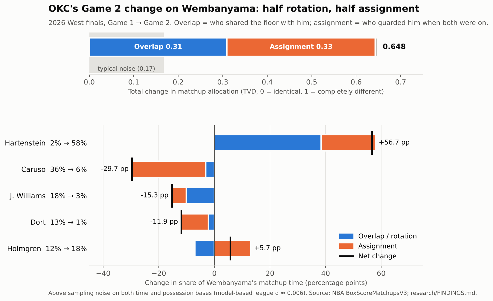

# NBA Playoff Matchup Adjustment Research

**When a playoff team changes who guards a star from one game to the next, how much of that change is a real reassignment, how much is just who happened to share the floor, and how much is sampling noise?**



In Game 1 of the 2026 West finals, Alex Caruso drew Victor Wembanyama. In Game 2, Isaiah Hartenstein took over. The raw change in OKC's matchup allocation was large (0.648 on a 0–1 scale), and this project splits it:

- **0.310 overlap / rotation:** Hartenstein's minutes went from 12 to 27, so he simply shared far more of Wembanyama's floor time.
- **0.333 assignment:** when both were on the floor, Hartenstein guarded him far more often; Caruso's drop sits almost entirely in this component.
- **Well above sampling noise**, which alone produces about 0.17 for a transition like this, on both a time-based and a possession-based model.

NBA.com's own coverage describes the same change. [Explore any player and series →](https://playoff-matchup-adjustment-tracker-zdee28tjezgw42ujydet6v.streamlit.app/)

## What the research found so far

From seven playoff series (39 games, 7,400+ NBA tracking matchup records):

1. **Raw matchup changes are inflated by small samples.** The typical game-to-game change is 0.27, but noise alone produces about 0.19, and measured changes grow as samples shrink. A noise baseline is required before calling anything an adjustment.
2. **Separating overlap from assignment matters.** In a [pre-registered face-validity check](research/FACE_VALIDITY.md), every overlap-dominant case matched a reported cause (a player on a minutes limit, a bench-heavy game, foul trouble) that would otherwise look like a coaching reassignment.
3. **Assignment changes are real but rarely reported.** Beyond the Wembanyama case, press coverage seldom names who guarded whom, so film review is the next validation step. Two flagged cases came from 20-point blowouts, which the league analysis now controls for.

League-scale answers (how common real adjustments are, whether they follow losses, what happens to the scorer next game) come from the [league pipeline](research/LEAGUE_FINDINGS.md). It currently runs on the development sample; multi-season data is fetched with one local command (below).

## How it works

```text
NBA matchup data (BoxScoreMatchupsV3) + box scores
        ↓
Realized share S, assignment rate A, overlap opportunity O   (M = O × A)
        ↓
Shapley split of each game-to-game change: overlap · assignment · entry/exit
        ↓
Sampling-noise baseline (time and possession bases), max-statistic and FDR corrections
        ↓
League questions: frequency, overlap vs assignment, after losses, next-game performance
```

- **Measures.** NBA's percentage fields are undocumented, so their meaning was [established from identities in the data](research/FINDINGS.md#phase-1--what-the-nba-percentage-fields-measure), including a scale anomaly in 5 of 39 games that the pipeline detects and does not depend on.
- **Decomposition.** A two-factor Shapley average makes the overlap/assignment split independent of order; it adds up exactly to the total change and is invariant to game length. Transitions where too few defenders can be compared are flagged.
- **Noise.** A parametric bootstrap on two bases, a null for each player's *largest* change (so picking the maximum is accounted for), and Benjamini–Hochberg FDR across all tests. All significance is model-based and stated with its assumptions.

## Limitations

- The model measures **assignment allocation, not coaching intent**. Intent needs external evidence (reporting, film).
- The noise model assumes independent possessions; real matchups come in stretches, so it is optimistic.
- Seven series is a development sample. League results need the multi-season run.

## Reproduce

```bash
pip install -r requirements.txt -r requirements-dev.txt
python -m pytest -q                                  # 247 tests, no network

python -m research.run_measure_audit                 # phase 1: what the fields mean
python -m research.run_decomposition                 # phase 2: overlap / assignment
python -m research.run_noise_model                   # phase 3: noise baselines
python -m research.run_league                        # phase 5: league findings
python -m research.make_hero_figure                  # the figure above
streamlit run app.py                                 # interactive explorer
```

Multi-season data (NBA blocks most cloud networks, so run on your own computer):

```bash
pip install -r requirements-data.txt
python -m scripts.fetch_playoffs --probe --seasons 2013-14:2025-26   # which seasons have data
python -m scripts.fetch_playoffs --seasons 2017-18:2025-26           # resumable
python -m research.run_league                                        # rerun on league data
```

## Repository

| Path | Contents |
| --- | --- |
| `analytics/` | `measures.py` (S, A, O and audits), `decomposition.py`, `null_model.py`, original V1 metrics |
| `research/` | Reproducible scripts, results, and the write-ups linked above |
| `data_sources/`, `scripts/` | NBA acquisition: per-series ingestion and league-wide `fetch_playoffs` |
| `data/` | Bundled API snapshots, box scores and game context for the seven series |
| `app.py` | Research explorer; `app_v1.py` is the original tracker dashboard |
| `archive/` | V1/V2 development history and validation logs ([original README](archive/README_V1.md)) |

The project began as a matchup tracker dashboard (tag `v1-archive`). Validating it showed that raw matchup shares mix rotation, assignment and noise, which led to this redesign.

## Author

**Ming Chen** · Wake Forest University MSBA, Sports Analytics
